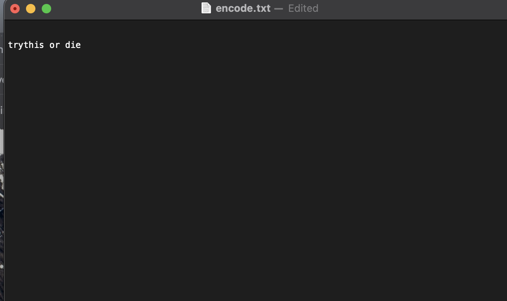
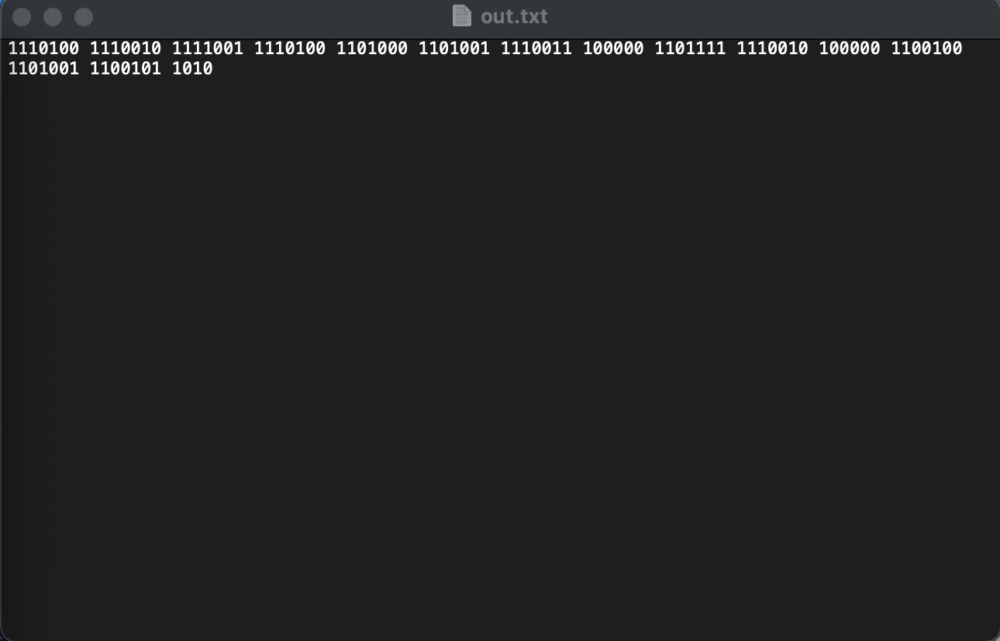

# Translator

## Clone :

    git clone https://github.com/OldKokoroz/Translator_Binary-to-Text.git

### No requirements Needed

## Usage :

python3 BinaryText.py 

(While using in the terminal Be careful that there is no empty space after file path )

## Modes : 

   "e" --> Encode

   "d" --> Decode

   "fe" --> File Encode

   "fd" --> File Decode

## Images 

